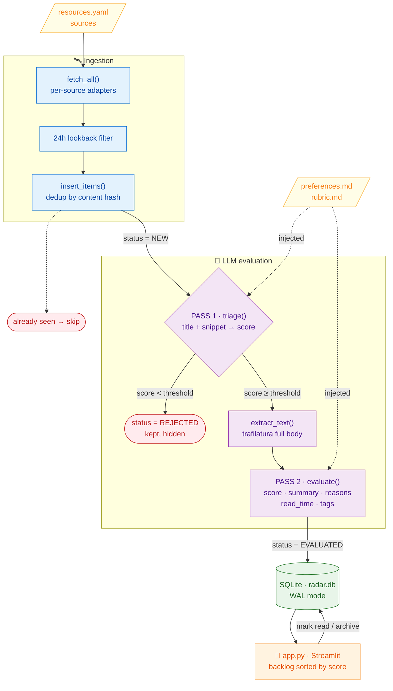

<h1 align="center">📡 AI Radar</h1>

<p align="center">
  <em>Your personal AI-news scout. Reads the firehose every morning so you only read what matters.</em>
</p>

<p align="center">
  
  
  
  
</p>

<!-- Add a screenshot or GIF of the backlog UI here once you run it:
      -->

## 🌟 Highlights

- 🧠 **An LLM reads for you.** Every item is scored, summarized in 2–3 sentences, and given an estimated read time — so you triage in seconds.
- 🎯 **It learns *your* taste.** Two plain-text prompt files (`preferences.md`, `rubric.md`) define what you care about and how to score it. No code, no retraining.
- 🗞️ **One feed for everything.** arXiv, Hugging Face, Hacker News, GitHub Trending, Reddit, and any RSS feed — all in a single scored backlog.
- 💸 **Practically free.** Runs on Groq's free tier or fully local with Ollama. Swap engines with one config line.
- 📥 **A backlog that waits for you.** Items persist until you mark them read — nothing scrolls away.
- 🧩 **Hackable by design.** Add a source in one YAML line; add an LLM provider in one class.

## ℹ️ Overview

**AI Radar** is a small app that keeps you current on AI without the doomscroll.
Once a morning it pulls fresh content from the sources *you* pick, asks an LLM
"is this worth this specific person's time?", and drops the keepers into a backlog
sorted by relevance — each with a short summary, the reason it matched you, and a
read-time estimate.

It's built around one idea: **fetching and judging are separate stages with a
database in between.** That checkpoint means a crash or an API rate-limit never
makes it re-download or re-pay to evaluate the same article twice.

Unlike a generic news reader or a "top AI links" newsletter, AI Radar is tuned to
**you** — your interests and your scoring rules live in editable text files, and
you own the source list. It's closer to a self-hosted research assistant than a
feed reader.

> ### 📖 概要（日本語）
>
> **AI Radar** は、毎朝あなたが選んだ情報源（arXiv・Hugging Face・Hacker News・
> GitHub・Reddit・各種 RSS）を自動で巡回し、LLM が「あなたにとって読む価値が
> あるか」を採点して、スコア順の**バックログ**を作るパーソナル AI ニュース
> アプリです。各記事には要約・推薦理由・推定読了時間が付き、読み終えるまで
> 残り続けます。このアプリの**堀（moat）** は、汎用ニュースアプリと違い、
> あなた専用の「好み」と「採点基準」をプロンプトで自由に編集でき、嗜好に
> 合わせて完全にカスタマイズできる点。取得と評価を分離した設計で重複や再課金を
> 防ぎ、Groq の無料枠とローカル Ollama を一行で切り替えてほぼ無料で運用可能です。

### 🧰 Tech stack

- **Ingestion:** feedparser (RSS) · httpx (APIs) · trafilatura (article text) · BeautifulSoup (GitHub scrape)
- **Storage:** SQLAlchemy + SQLite (WAL mode)
- **LLM:** Groq / Ollama behind one swappable provider
- **UI & config:** Streamlit · PyYAML
- **Scheduling:** Windows Task Scheduler (cron on macOS/Linux)

### ✍️ Author

Built by David Valls. Made because
keeping up with AI shouldn't cost an hour of scrolling every day.

## ⬇️ Installation

Requires **Python 3.10+**. Works on Windows, macOS, and Linux.

```powershell
pip install -r requirements.txt
```

Then add a free Groq API key (get one at <https://console.groq.com/keys>) and
reopen your terminal:

```powershell
setx GROQ_API_KEY "gsk_your_key_here"
```

> Prefer to run fully offline? Skip the key, install [Ollama](https://ollama.com),
> run `ollama pull qwen3:8b`, and set `provider: ollama` in `config.yaml`.

## 🚀 Usage

Fill the backlog, then open it:

```powershell
python main.py          # fetch → judge → store (run it any morning)
streamlit run app.py    # browse the scored backlog
```

That's the whole loop. In the UI you filter by source/score, read each item's
summary, and click **Mark read** or **Archive**. To run it automatically every
morning, see [Schedule it at 7am](#-schedule-it-at-7am).

All CLI commands:

| Command | What it does |
|---|---|
| `pip install -r requirements.txt` | Install all dependencies. |
| `setx GROQ_API_KEY "gsk_..."` | Store your Groq key (reopen the terminal after). |
| `python main.py` | Run the full pipeline: fetch → dedup → triage → deep-eval. Safe to re-run; dedup prevents repeats. |
| `streamlit run app.py` | Open the backlog UI in the browser. |
| `ollama pull qwen3:8b` | Download the local fallback model (only if using Ollama). |
| `ollama serve` | Start the local Ollama server (usually auto-starts). |
| `setx OLLAMA_API_KEY "..."` | Store an Ollama Cloud key (only for `host: https://ollama.com`). |

Behavior is driven entirely by `config.yaml`, `resources.yaml`, and the two prompt
files — there are no subcommands or flags. Change a file, re-run `python main.py`.

## ⚙️ Configure it for you

Four files, all plain text — edit and re-run `python main.py`:

| File | What you change |
|---|---|
| `prompts/preferences.md` | Who you are and what you care about. |
| `prompts/rubric.md` | How to score items + the read-time rules. |
| `resources.yaml` | Your sources. Add an RSS feed in one line; toggle any source with `enabled: true/false`. |
| `config.yaml` | LLM provider/model, the 24h window, the triage threshold. |

## 🧠 Models

AI Radar speaks to **one LLM through a swappable interface**, so you choose your
engine with a single line in `config.yaml`:

```yaml
llm:
  provider: groq          # "groq" or "ollama"
```

| Backend | Default model | Cost | Best for |
|---|---|---|---|
| `groq` | `llama-3.3-70b-versatile` | Free tier | **Primary** — best quality + speed for free. |
| `ollama` | `qwen3:8b` | Free (local) | Fallback / offline / past Groq's daily limit. |

**Change the model:** edit the `model:` field under the chosen backend (e.g.
`llama-3.1-8b-instant` on Groq, or `gemma3:12b` locally after `ollama pull`).

**Ollama Cloud** (bigger models, no local GPU): set `host: https://ollama.com`,
`api_key_env: OLLAMA_API_KEY`, and `setx OLLAMA_API_KEY "..."`.

**Add a new provider** (OpenAI, Together, …): write a class with
`.complete(system, user)` + `.name` in `evaluator.py` and add one branch to
`make_provider()`. Nothing else changes.

## 🗺️ How it works (pipeline)

Items flow top to bottom; the DB is the checkpoint between stages, and each item's
`status` records how far it got.



Module map: `fetcher.py` (sources → one shape) · `db.py` (SQLite + lifecycle) ·
`evaluator.py` (LLM scoring) · `main.py` (orchestrator) · `app.py` (UI).
Deeper build notes live in [`private-study/`](private-study/).

## ⏰ Schedule it at 7am

On Windows, use **Task Scheduler → Create Basic Task**:

- **Trigger:** Daily, 07:00.
- **Action:** Start a program → `python`, arguments `main.py`, start-in
  `c:\Users\dvall\Documents\ai-radar`.
- In the task's properties, enable **"Run task as soon as possible after a
  scheduled start is missed"** so it catches up if the PC was asleep.

(macOS/Linux: a `cron` entry like `0 7 * * * cd /path/ai-radar && python main.py`.)

## 💸 Cost

Around **$0/month**. Everything runs locally; the only external call is the LLM —
Groq's free tier, or Ollama on your own machine. Two-pass triage and text
truncation keep token usage small.

## 💭 Contributing & feedback

This is a personal project, but ideas are welcome — open an issue for a new source
adapter, a provider, or a UI tweak. The two easiest ways to extend it:

- **New feed:** one entry in `resources.yaml`.
- **New source type or LLM provider:** one function/class as described above.

## 📖 Further reading

- [Groq API docs](https://console.groq.com/docs)
- [Ollama docs](https://github.com/ollama/ollama)
- [trafilatura](https://trafilatura.readthedocs.io/) · [feedparser](https://feedparser.readthedocs.io/) · [Streamlit](https://docs.streamlit.io/)
